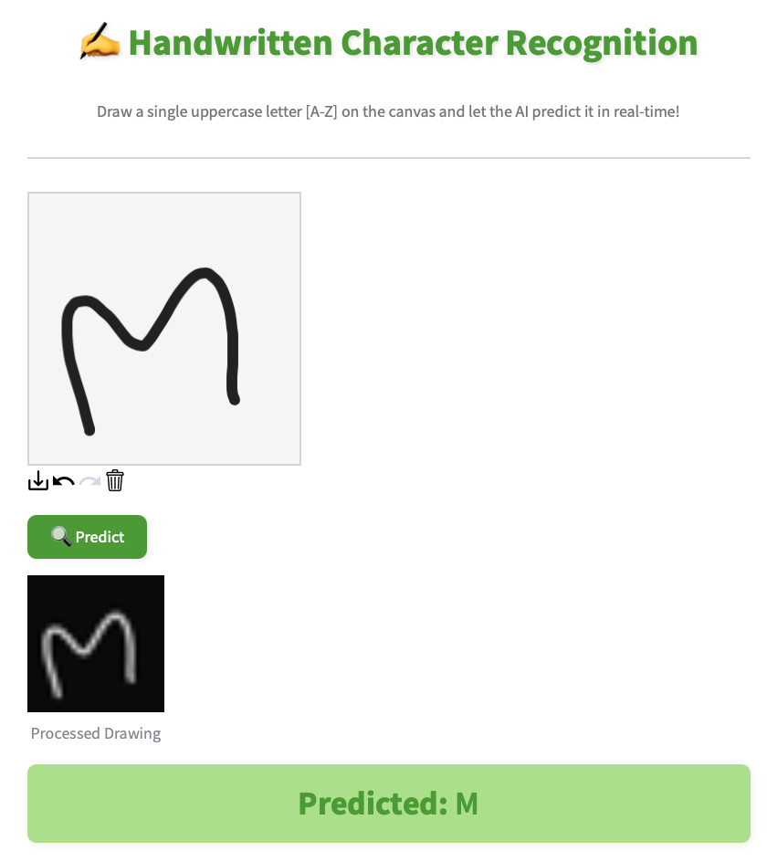

# 🖋️ Handwritten Alphabet Detection using CNN

## Overview
This project implements a Convolutional Neural Network (CNN) to recognize handwritten English alphabets (A–Z).
Users can draw letters on a canvas in a web app powered by Streamlit, and the model predicts the corresponding letter in real-time. The app is deployed on Streamlit Cloud for public access
[Visit Streamlit](https://handwritten-alphabet-cnn-maryam.streamlit.app)

### Features
- Predict handwritten English alphabets (A–Z)
- Draw letters directly in the browser using a drawable canvas
- Real-time predictions with a trained CNN model
- Preprocessing handles custom backgrounds and normalizes inputs

### Dataset
- The model was trained on the Kaggle handwritten alphabets dataset
- 26 classes representing letters A–Z
- Images are preprocessed to 28×28 grayscale for CNN input

### Model Architecture
- Input: 28×28 grayscale images
- Layers:
    - Conv2D → MaxPooling2D → Conv2D → MaxPooling2D → Conv2D → MaxPooling2D
    - Flatten → Dense(128, activation='relu') → Dropout(0.4) → Dense(26, activation='softmax')
- Loss function: Categorical crossentropy
- Optimizer: Adam
- Metrics: Accuracy